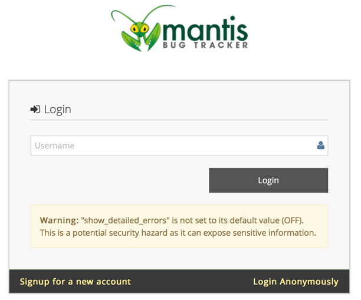

# SampleAuth Plugin

This is a sample authentication plugin showing how a MantisBT authentication plugin can implement its own authentication and control authentication related flags on a per user basis.

The authentication mechanism implemented by this plugin works as follows:
- If user is administrator, use standard authentication.
- If user is not registered in the db, user standard behavior.
- Otherwise, auto-signin the user without a password.

Users that are auto-signed in, can't manage or use passwords that are stored in the MantisBT database.

The plugin can be easily modified to redirect to an identity provider and validate the token returned or validate a username and password against a database or LDAP.

## Authentication Flags
The authentication flags events enables the plugin to control MantisBT core authentication behavior on a per user basis.
Plugins can also show their own pages to accept credentials from the user.

- `password_managed_elsewhere_message` message to show in MantisBT UI to indicate that password is managed externally.  If left blank or not set, the default message will be used.
- `can_use_standard_login` true then standard password form and validation is used, false: otherwise.
- `login_page` Custom login page to use.
- `credential_apge` The page to show to ask the user for their credential.
- `logout_page` Custom logout page to use.
- `logout_redirect_page` Page to redirect to after user is logged out.
- `session_lifetime` Default session lifetime in seconds or 0 for browser session.
- `perm_session_enabled` Flag indicating whether remember me functionality is enabled (ON/OFF).
- `perm_session_lifetime` Lifetime of session when user selected the remember me option.
- `reauthentication_enabled` A flag indicating whether reauthentication is enabled (ON/OFF).
- `reauthentication_expiry` The timeout to require re-authentication.  This is only applicable if `reauthentication_enabled` is set to ON.

If a flag is not returned by the plugin, the default value will be used based on MantisBT core configuration.

The plugin will get a user id and username within an associative array.  The flags returned are
in context of such user.  If user is not in db, then user_id will be 0, but username will be what
the user typed in the first login page that asks for username.

If plugin doesn't want to handle a specific user, it should return null.  Otherwise, it should
return the `AuthFlags` with the overriden settings.

## Screenshots

Native Login Page for Username

Native Credentials Page for Password (skipped for non-administrators)

User My Account Page

## Dependencies
MantisBT v2.3.0-dev once auth plugin support is added.
